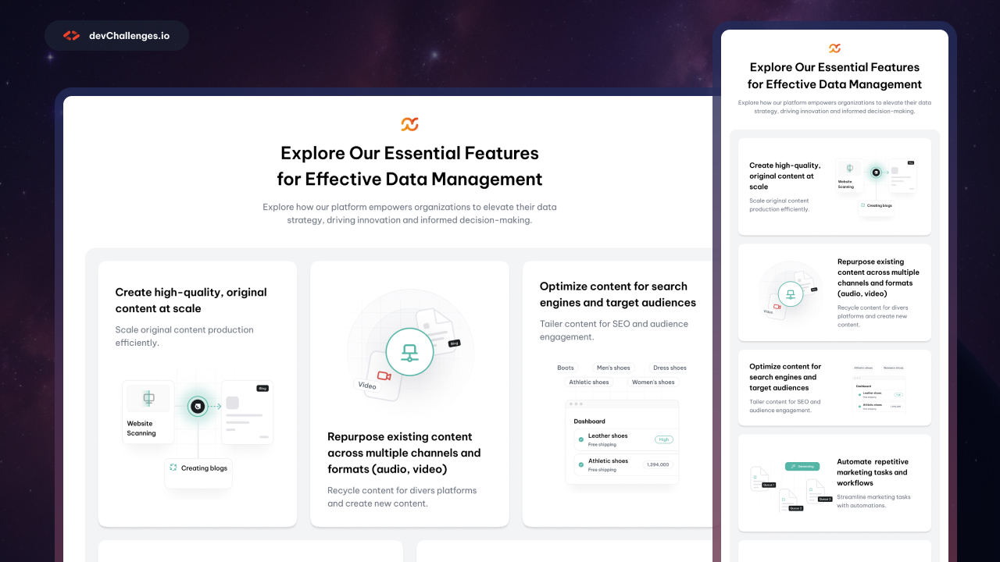

# <h1 align="center">Bento Box Layout Feature Section| devChallenges</h1>

## The challenge

Your task is to create a web page that closely resembles the provided design.

You can use any tools or resources you like to complete this challenge. Each challenge is designed to practice different skills, so be sure to check the challenge description for more information.

If you need help or have any questions, feel free to [join our community](https://github.com/orgs/devchallenges-io/discussions) and ask for support.

## Overview
This project is a responsive FAQ web page built as part of the devChallenges.io Simple FAQ challenge. 

### What I learned
Through this project I gained insight on:
- Semantic HTML: Used proper semantic elements for better accessbility
- CSS: Implemented flexible layouts for responsive design
-  Responsive Design: Created a mobile-first structure for different screen sizes
  

### Tech Stack

- Semantic HTML5 markup (Vanilla html5)
- CSS custom properties (Vanilla CSS)
- Flexbox
- CSS Grid

## Feedback
I enhanced my skill using flexbox and grid to create a responsive layout for the article listing through this insightful challenge provided by <a href="https://devchallenges.io/"> devChallenges.io</a> 

## Author
- GitHub <a href= "https://github.com/JohnCAdrian"> JohnCAdrian </a>
